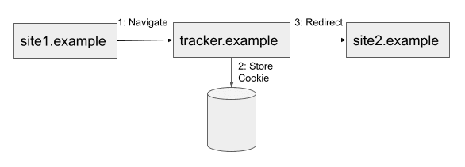

**Bounce tracking mitigations** is a browser feature that enhances user privacy by protecting against **bounce tracking**. This article explains what bounce tracking is, and how bounce tracking mitigations work.

## Bounce tracking defined

Bounce tracking (sometimes called redirect tracking) is an abuse of cross-site navigation in which a tracker redirects a user to their website for the purpose of setting a first-party cookie to track that user across other sites. The redirection can happen so quickly that a user may not even notice it.

In effect, bounce tracking enables tracking cookies to be set even if the browser has [third-party cookies](/en-US/docs/Web/Privacy/Guides/Third-party_cookies) disabled.

Bounce tracking can be done in a couple of different ways:

1. As a "bounce back". In this case, the user starts on a website (`site1.example`), is navigated to a tracker site (`tracker.example`) where the tracking cookie is set, and then redirected back to `site1.example`.

   

2. As a "bounce through". In this case, the user starts on a website (`site1.example`), is navigated to a tracker site (`tracker.example`) where the tracking cookie is set, and then redirected to another site (`site2.example`).

   

In both instances, users may be unaware they have visited `tracker.example`. They may believe they have only visited `site1.example` or tried to navigate to `site2.example`.

## How Bounce tracking mitigations work

Bounce tracking mitigations work by identifying tracker sites via a heuristic and periodically deleting cookies and other state data associated with them (for example, [localStorage](/en-US/docs/Web/API/Web_Storage_API), [IndexedDB](/en-US/docs/Web/API/IndexedDB_API), [Cache API](/en-US/docs/Web/API/CacheStorage), or network state data). The feature avoids using block or allow lists to decide which websites are affected.

It is critical that, while defending against bounce tracking, the browser doesn't interfere with legitimate, non-tracking redirection flow uses. For example, single sign-on (SSO), [identity federation](/en-US/docs/Web/API/FedCM_API#fedcm_concepts), and payment services generally involve redirecting the user to another site where they perform an action, updating state information as a result, then redirecting the user back to the original site.

The process works as follows:

1. The browser monitors navigations and flags sites that are part of a "bounce", meaning sites through which a navigation was redirected. This includes both server-initiated redirections and client-side redirections where JavaScript programmatically triggers a navigation.
2. The browser periodically examines its list of flagged sites and checks to see if the user has actively used the site by interacting with it within the last 45 days. Example interactions include clicking a button, entering data into a form, and scrolling the site. The interaction can occur before, during, or after the bounce was detected.
3. If the site does not have any user interaction and third-party cookies are blocked, then its state will be deleted.

The heuristic operates on sites defined by {{Glossary("eTLD", "eTLD+1")}}. As a result, both `foo.example.site` and `bar.example.site` are treated as `example.site`.

## Specifications

{{specifications}}

## Browser support

- Chromium's implementation of bounce tracking mitigations was shipped in version 116.
- Firefox [also supports it](https://firefox-source-docs.mozilla.org/toolkit/components/antitracking/anti-tracking/bounce-tracking-protection/).
- WebKit first shipped bounce tracking protection in [ITP 2.0](https://webkit.org/blog/8311/intelligent-tracking-prevention-2-0/).
